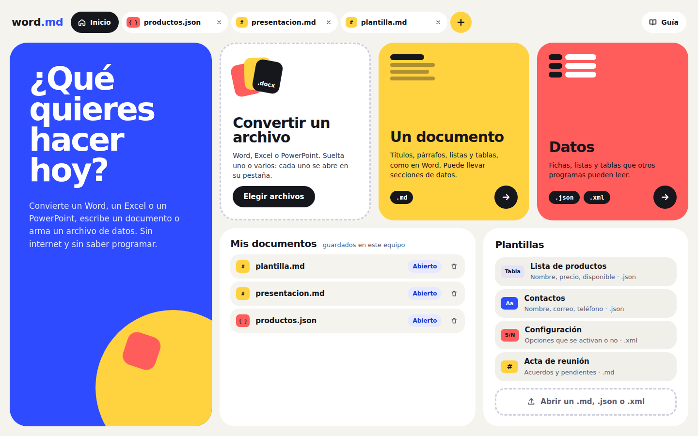
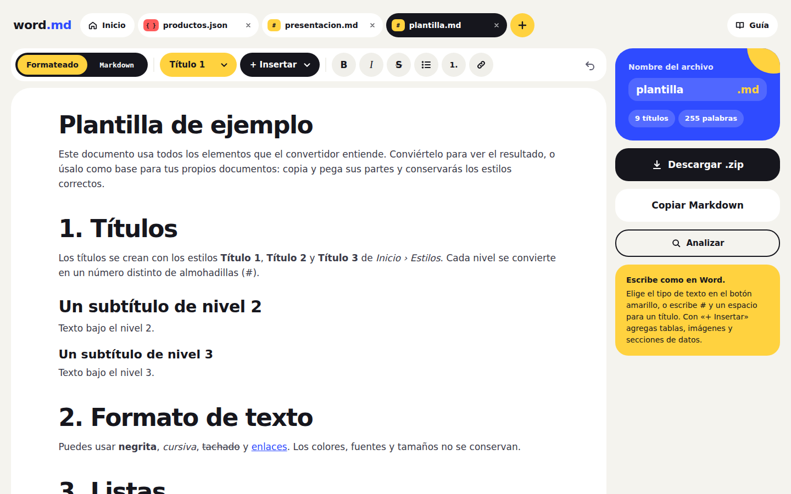
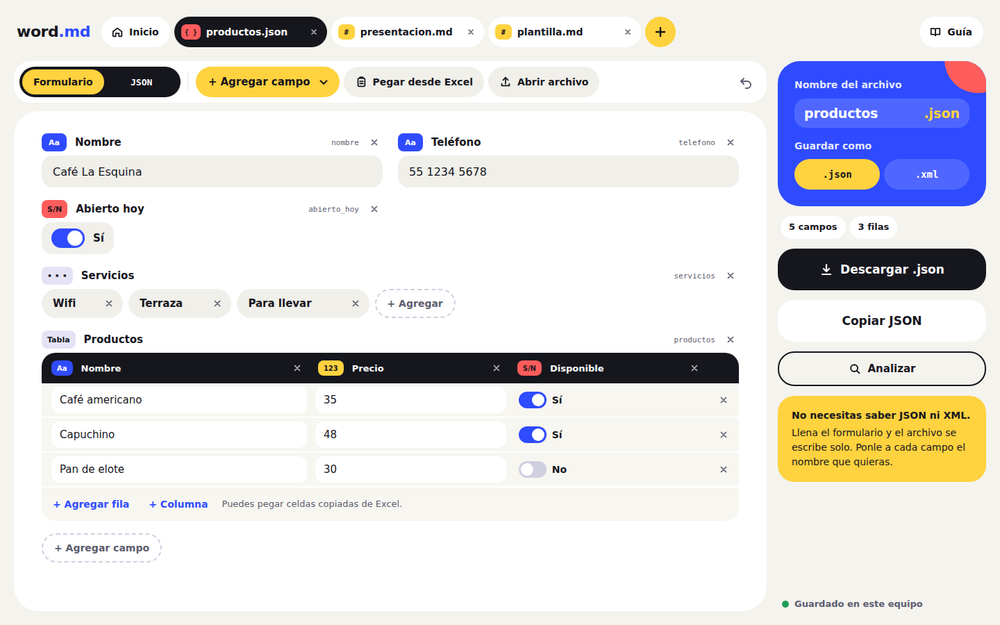
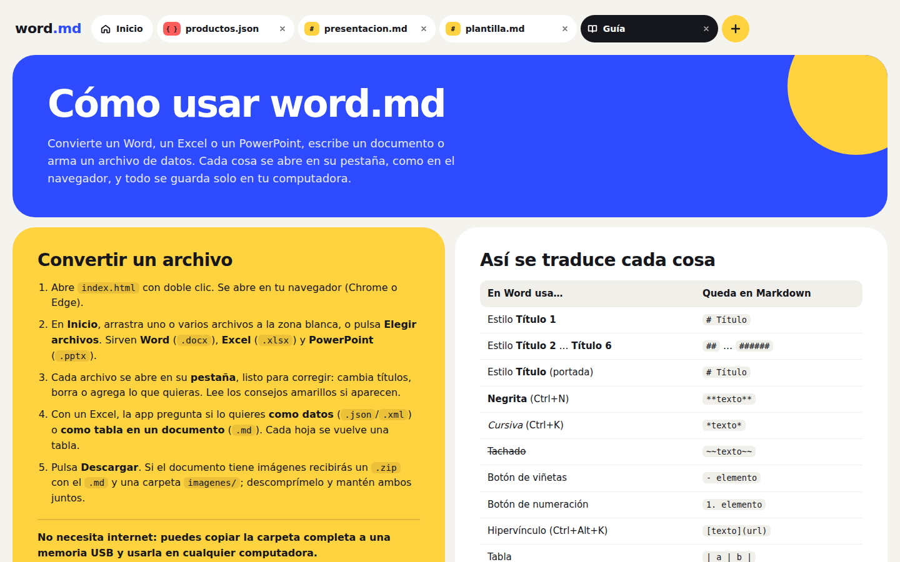

# word.md — Convierte y crea documentos, sin internet

**Convierte Word, Excel y PowerPoint a Markdown, y crea documentos `.md` y archivos de datos `.json`/`.xml` sin saber programar.** Sin internet, sin instalar nada y sin subir tus documentos a ningún sitio: todo ocurre dentro de tu navegador.



## Empieza en 30 segundos

1. **Descarga** este proyecto: botón verde **Code › Download ZIP** (arriba en esta página) y descomprímelo.
2. **Abre** `index.html` con doble clic. Se abre en Chrome, Edge o Firefox.
3. **Suelta** tus archivos `.docx`, `.xlsx` o `.pptx` en la zona blanca. Cada uno se abre en su pestaña: corrígelo si quieres y pulsa **Descargar**.

Listo. Puedes copiar la carpeta a una memoria USB y usarla en cualquier computadora, incluso sin conexión.

## Qué puedes hacer



- **Convertir Word** (`.docx`) a **Markdown limpio**, compatible con GitHub, Obsidian, Notion, Docusaurus y cualquier editor de Markdown.
- **Convertir Excel** (`.xlsx`): cada hoja se vuelve una tabla, como **datos** (`.json`/`.xml`) o **dentro de un documento** (`.md`).
- **Convertir PowerPoint** (`.pptx`): cada diapositiva se vuelve una sección con su título, viñetas, tablas, imágenes y notas.
- **Editar lo convertido** como en Word: cambia títulos, borra o agrega párrafos, tablas, imágenes y **secciones de datos**. El botón **Markdown** muestra el texto tal cual se guarda.
- **Crear desde cero** un documento o un archivo de datos con un formulario (texto, número, sí/no, fecha, listas, tablas y grupos). Puedes pegar celdas de Excel y cambiar entre JSON y XML con un clic.
- **Pestañas**, como en el navegador: varios documentos abiertos a la vez. Al cerrar una pestaña el documento sigue en **Mis documentos**.
- **Imágenes incluidas**: si el documento tiene imágenes, descargas un `.zip` con el `.md` y una carpeta `imagenes/`, enlazadas correctamente.
- **Consejos automáticos** cuando algo no tiene equivalente en Markdown (estilos propios, celdas combinadas, gráficos…), para que sepas qué revisar.
- **Analizar** un documento: una revisión rápida sin internet y, si quieres, un resumen con sugerencias de **Claude** (opcional; usa internet y tu clave de API de Anthropic, y siempre avisa antes de enviar nada).



### Qué se convierte del Word

| En Word | En Markdown |
|---|---|
| Estilos Título 1 … Título 6 | `#` … `######` |
| Negrita, cursiva, tachado | `**negrita**`, `*cursiva*`, `~~tachado~~` |
| Listas con viñetas y numeradas (con subniveles) | `- elemento`, `1. elemento` |
| Tablas | tablas GFM `\| a \| b \|` |
| Hipervínculos | `[texto](url)` |
| Estilo Cita | `> cita` |
| Estilo Código | bloque ```` ``` ```` |
| Imágenes | `` |

Lo que Markdown no admite se pierde: colores, fuentes, encabezados y pies de página, cuadros de texto, celdas combinadas y comentarios. De Excel se pierden fórmulas (queda su resultado), gráficos y formatos; de PowerPoint, el diseño, las animaciones y la posición de los elementos.

## Prepara bien tu Word

El resultado depende de que el Word use **estilos**, no solo formato. Lo más importante:

- Aplica **Título 1, Título 2…** desde *Inicio › Estilos*. Un texto grande y en negrita no se convierte en título.
- Haz las listas con los **botones de viñetas o numeración**, no escribiendo guiones a mano.
- Usa **tablas sencillas**, con la primera fila como encabezado y sin celdas combinadas.
- Pon las imágenes **"En línea con el texto"**.

📘 La guía completa está en **[GUIA.md](GUIA.md)** y también dentro de la app, en el botón **Guía**. Para practicar, en `ejemplo/` hay un Word, un Excel y un PowerPoint de prueba.



## Privacidad

Tus documentos **nunca salen de tu computadora**. La página no hace ninguna conexión a internet: todas las librerías están incluidas en la carpeta `vendor/` y la conversión se hace en el navegador. Los documentos que creas se guardan en el propio navegador.

La única excepción es opcional: si en **Analizar** eliges **Claude** y escribes tu clave de API, el documento que estás analizando se envía a Anthropic. La app lo avisa antes de enviarlo y nunca lo hace por su cuenta.

## Estructura del proyecto

```
index.html        la app (ábrela con doble clic)
app.js            conversión de Word y utilidades compartidas
importar.js       lectura de Excel (.xlsx) y PowerPoint (.pptx)
crear.js          editor de documentos y editor de datos (JSON/XML)
pestanas.js       pestañas, Inicio, Mis documentos y entrada de archivos
analisis.js       Analizar: revisión local y proveedores de IA opcionales
styles.css        diseño
vendor/           librerías locales: mammoth, turndown, marked, jszip
ejemplo/          un Word, un Excel y un PowerPoint de ejemplo
docs/capturas/    imágenes de este README
herramientas/     scripts de desarrollo (Node); la app no los necesita
GUIA.md           guía de uso y de cómo preparar el Word
AGENTS.md         documentación técnica para seguir desarrollando
```

## Desarrollo

Consulta **[AGENTS.md](AGENTS.md)**: arquitectura, secciones del código, restricciones y cómo probar.

Para ejecutar las pruebas (requiere Node, solo para desarrollar):

```bash
cd herramientas
npm install
npm run probar:todo    # convertidor
npm run probar:crear   # pestañas, editores, Excel, PowerPoint y Analizar
```

## Créditos

La conversión usa [mammoth.js](https://github.com/mwilliamson/mammoth.js), [Turndown](https://github.com/mixmark-io/turndown), [marked](https://github.com/markedjs/marked) y [JSZip](https://github.com/Stuk/jszip). Excel y PowerPoint se leen con código propio sobre JSZip. Las licencias están en [`vendor/LICENSES.md`](vendor/LICENSES.md).
