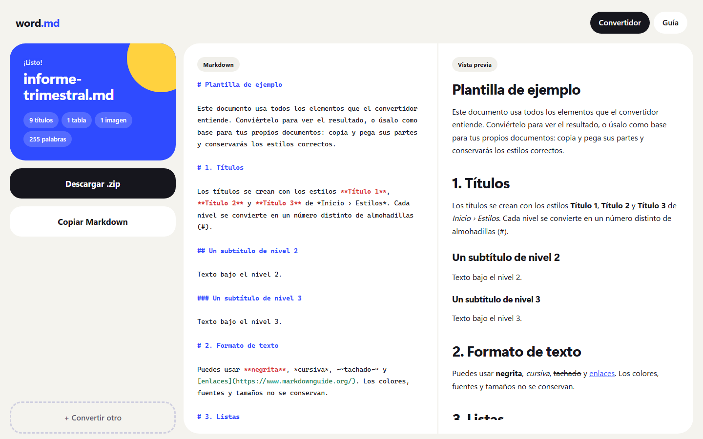

# word.md — Convertidor de Word a Markdown

**Convierte archivos `.docx` a Markdown en tu computadora, y crea documentos `.md` y archivos de datos `.json`/`.xml` sin saber programar.** Sin internet, sin instalar nada y sin subir tus documentos a ningún sitio: todo ocurre dentro de tu navegador.


## Empieza en 30 segundos

1. **Descarga** este proyecto: botón verde **Code › Download ZIP** (arriba en esta página) y descomprímelo.
2. **Abre** `index.html` con doble clic. Se abre en Chrome, Edge o Firefox.
3. **Suelta** tus archivos `.docx` en la zona blanca y pulsa **Descargar**.

Listo. Puedes copiar la carpeta a una memoria USB y usarla en cualquier computadora, incluso sin conexión.

## Qué obtienes



- **Markdown limpio**, compatible con GitHub, Obsidian, Notion, Docusaurus y cualquier editor de Markdown.
- **Vista previa** al lado del código, para comprobar el resultado antes de descargarlo.
- **Imágenes incluidas**: si el Word tiene imágenes, descargas un `.zip` con el `.md` y una carpeta `imagenes/`, enlazadas correctamente.
- **Varios archivos a la vez**, con un botón para descargarlos todos juntos.
- **Consejos automáticos** cuando algo del Word no tiene equivalente en Markdown (estilos propios, celdas combinadas, documentos sin títulos…), para que sepas qué corregir.

### Qué se convierte

| En Word | En Markdown |
|---|---|
| Estilos Título 1 … Título 6 | `#` … `######` |
| Negrita, cursiva, tachado | `**negrita**`, `*cursiva*`, `~~tachado~~` |
| Listas con viñetas y numeradas (con subniveles) | `- elemento`, `1. elemento` |
| Tablas | tablas GFM `\| a \| b \|` |
| Hipervínculos | `[texto](url)` |
| Estilo Cita | `> cita` |
| Estilo Código | bloque ```` ``` ```` |
| Imágenes | `` |

Lo que Markdown no admite se pierde: colores, fuentes, encabezados y pies de página, cuadros de texto, celdas combinadas y comentarios.

## Crear documentos y datos

En la pestaña **Crear** puedes empezar desde cero:

- **Un documento** (`.md`): escribes como en Word y eliges el tipo de texto (párrafo, títulos, cita, código) en un menú. Cambia a la vista **Markdown** para ver o corregir el texto tal cual se guarda.
- **Secciones de datos dentro del documento**: *Insertar › Datos en JSON/XML* agrega una tabla o un formulario que se guarda como un bloque ```` ```json ```` o ```` ```xml ```` en el `.md`.
- **Datos** (`.json` o `.xml`): un formulario con campos de texto, número, sí/no, fecha, listas, tablas y grupos. Puedes pegar celdas de Excel y cambiar entre JSON y XML con un clic.

Todo se guarda automáticamente en tu navegador. Si corriges el código a mano y hay un error, la app marca la línea antes de volver a la vista con formato.

## Prepara bien tu Word

El resultado depende de que el Word use **estilos**, no solo formato. Lo más importante:

- Aplica **Título 1, Título 2…** desde *Inicio › Estilos*. Un texto grande y en negrita no se convierte en título.
- Haz las listas con los **botones de viñetas o numeración**, no escribiendo guiones a mano.
- Usa **tablas sencillas**, con la primera fila como encabezado y sin celdas combinadas.
- Pon las imágenes **"En línea con el texto"**.

📘 La guía completa está en **[GUIA.md](GUIA.md)** y también dentro de la app, en la pestaña **Guía**. Para practicar, convierte `ejemplo/plantilla.docx` o úsalo como base para tus documentos.


## Privacidad

Tus documentos **nunca salen de tu computadora**. La página no hace ninguna conexión a internet: todas las librerías están incluidas en la carpeta `vendor/` y la conversión se hace en el navegador.

## Estructura del proyecto

```
index.html        la app (ábrela con doble clic)
app.js            lógica de conversión
crear.js          sección Crear: editor de documentos y de datos (JSON/XML)
styles.css        diseño
vendor/           librerías locales: mammoth, turndown, marked, jszip
ejemplo/          plantilla.docx de ejemplo
docs/capturas/    imágenes de este README
herramientas/     scripts de desarrollo (Node); la app no los necesita
GUIA.md           guía de uso y de cómo preparar el Word
AGENTS.md         documentación técnica para seguir desarrollando
```

## Desarrollo

Consulta **[AGENTS.md](AGENTS.md)**: arquitectura, secciones del código, restricciones y cómo probar.

Para ejecutar las pruebas (requiere Node, solo para desarrollar):

```bash
cd herramientas
npm install
npm run probar:todo    # convertidor
npm run probar:crear   # sección Crear
```

## Créditos

La conversión usa [mammoth.js](https://github.com/mwilliamson/mammoth.js), [Turndown](https://github.com/mixmark-io/turndown), [marked](https://github.com/markedjs/marked) y [JSZip](https://github.com/Stuk/jszip). Las licencias están en [`vendor/LICENSES.md`](vendor/LICENSES.md).
